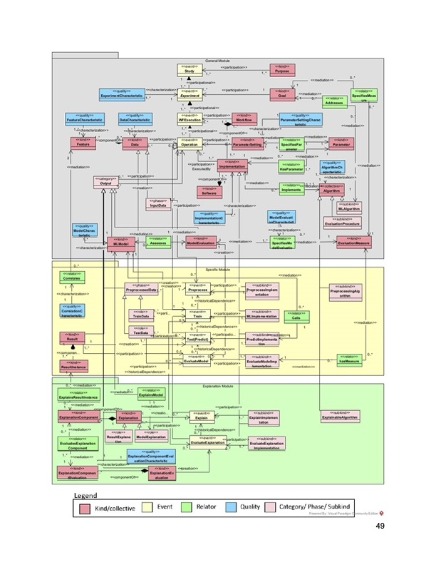

# Rest Directory

This directory attempts to create a RESTful version of the Explainable ML Ontologies found in [../Protege_Ontologies](../Protege_Ontologies/) sibling directory.

The aim is to create a publishable repository that could be re-used widely.
To do this we
 * cleanly seperate the 3 layers into files
 * avoid duplication of definitions by linking to the definitions locally and remotely
 * seperate instanc examples from the ontology definitions
 * in order not to tie the names of concepts or instances to a given representation we create symbolic links to the `.ttl` files. This mimics content-negotiatoon on the web server with Turtle being the default content-type. So instead of defining `general.ttl#Experiment` we define `general#Experiment` in the turtle file. This will allow other representations to define the same concepts, by always linking back to the non content-negotiated resource name.
 
The ontology is divided into 3 files

 * [general](general.ttl) - derived from [MLOntology_General2.ttl](../Protege_Ontologies/MLOntology_General2.ttl)
 * [specific](specific.ttl) - derived from [MLOntology_Specific.ttl](../Protege_Ontologies/MLOntology_Specific.ttl)
 * [explanation](explanation.ttl) - derived from [MLOntology_Explanation.ttl](../Protege_Ontologies/MLOntology_Explanation.ttl). 

which follows the layers shown on p49 of the Master's Thesis

